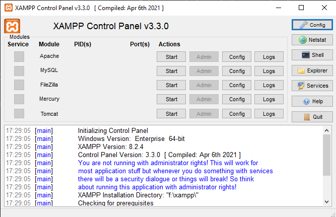

# **Marmoraria Chiovetto**  

## **Índice**
1. [Sobre o Projeto](#sobre-o-projeto)
2. [Funcionalidades](#funcionalidades)
3. [Tecnologias Utilizadas](#tecnologias-utilizadas)
4. [Instalação e Execução](#instalação-e-execução)
5. [Licença](#licença)
6. [Contato](#contato)

---

## **Sobre o Projeto**
Este projeto foi desenvolvido como parte do Trabalho de Conclusão de Curso (TCC) para o curso de Análise e Desenvolvimento de Sistemas da **ETEC Fernando Prestes**. Ele aborda a construção de um sistema web para uma marmoraria que, anteriormente, não possuía nenhuma ferramenta tecnológica para gerenciamento de orçamentos, clientes e produção.

O projeto foi apresentado com sucesso para a banca e aprovado. Embora tenha sido oficialmente encerrado como TCC, ele continua sendo atualizado com melhorias para servir como um projeto de portfólio.

---

## **Funcionalidades**
- **Usuário Cliente:**
  - Cadastrar-se na plataforma
  - Agendar, editar e excluir horários de atendimento

- **Usuário Administrador:**
  - Gerenciar orçamentos (cadastrar, editar e excluir)
  - Gerenciar funcionários (cadastrar, editar e excluir)
  - Gerenciar produtos (cadastrar, editar e excluir)
  - Atualizar o status dos orçamentos pagos e enviá-los para produção
  - Excluir orçamentos após a conclusão da produção

- **Usuário Funcionário:**
  - Visualizar orçamentos atribuídos
  - Editar a data e os horários de atendimento

> **Nota:** Existe um arquivo `password.txt` no projeto com e-mails e senhas padrão para testes.

---

## **Tecnologias Utilizadas**
- **Linguagens**: PHP, JavaScript
- **Frameworks**: Bootstrap 5
- **Banco de Dados**: MySQL
- **Outras Ferramentas**: XAMPP, PHPMyAdmin

---

## **Instalação e Execução**
Para rodar o projeto localmente, siga os passos abaixo:

1. **Instale o XAMPP** na versão [8.2.4](https://sourceforge.net/projects/xampp/files/XAMPP%20Windows/8.2.4/).

2. **Clone o repositório** dentro da pasta `htdocs` do XAMPP:
   ```bash
   cd C:/xampp/htdocs
   git clone https://github.com/devDavyRibeiro/marmoraria.git
   ```

3. **Inicialize os módulos Apache e MySQL** pelo painel do XAMPP.


4. **Importe o banco de dados**:
   - Acesse o PHPMyAdmin pelo navegador (`http://localhost/phpmyadmin`).
   - Crie um banco de dados chamado `marmoraria`.
   - Importe o arquivo `banco.sql` localizado no diretório raiz do projeto.

5. **Execute o projeto**:
   - Acesse `http://localhost/marmoraria/` no navegador.

---

## **Licença**
Este projeto está licenciado sob a Licença MIT. Consulte o arquivo `LICENSE` para mais detalhes.

---

## **Contato**
- **Autor**: Davy Ribeiro  
- **E-mail**: [davy.oliv.ribeiro@gmail.com](mailto:davy.oliv.ribeiro@gmail.com)  
